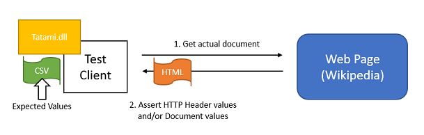
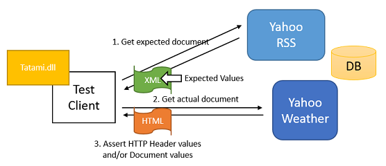
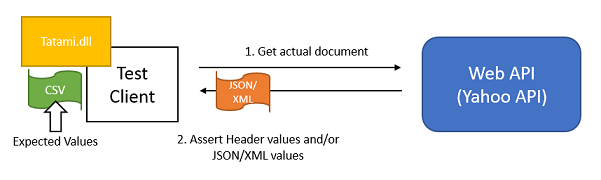

# tatami

A ruby gem for web application testing.
Please see [.NET version](https://github.com/kenyamat/Tatami-dotnet).

* Manages test cases in CSV file like [this](https://docs.google.com/spreadsheets/d/1Gvnq2NlBXyrnsjBH0Xr-R8U0f9RLeCR9RH5eAdTL_XE/edit?usp=sharing).
	* HTTP request conditions to get test documents (Uri, Method, UseAgent, QueryString, PathInfos, Header, Cookie)
	* Test cases and Assert conditions
* Verifies HTTP response information.
	* HTTP response header, cookies, status code, URL
	* Document structure (HTML, XML, JSON and Other text format)
* Can be integrated in major test frameworks and CI.
	* RSpec, Test::Unit, Cucumber, Jenkins etc.

Tatami enables you to reduce test codes and help review for test cases.

## Contents
* [Scope](#Scope)
* [Functions](#Functions)
* [Showcase](#Showcase)
* [Implementation](#Implementation)
	* [How to create a test case CSV](#CSV_implementation)
	* [How to create BaseUriMapping.xml](#BaseUriMapping.xml_settings)
	* [How to create UserAgentMapping.xml](#UserAgentMapping.xml_settings)
* [Setup steps](#Setup_steps)
* [Dependencies](#Dependencies)
* [Copyright](#Copyright)

## <a name="Scope">Scope</a>
This library covers the following test types.
* Integration Test
* Acceptance Test
* Smoke Test
* (not for Unit Test)

## <a name="Functions">Functions</a>
Tatami provides the following test functions.
* Manage HTTP request information, test cases and assert conditions in CSV.
* Get expected and actual documents (such as HTML, XML, JSON and Other formats).
* Test HTTP response information (Uri, Status Code, Header, Cookie, Format using XSD).
* Test response documents using expected values, XPath and regular expression.
* Provide failed information.

## <a name="Showcase">Showcase</a>
### 1. HTML page test (Wikipedia)
Test the HTML structure of the "United States" Wikipedia article by expecting static values.
* This scenario covers to test between html values and static values in CSV.
* See [Wikipedia page test](docs/sc_wikipedia.md) for details.



### 2. HTML page test using Web API (Yahoo Weather)
Test the HTML structure of the "New York" Wikipedia article by expecting values from Web APIs (Yahoo Weather RSS).
* Recent Web applications consume data created by Web APIs instead of databases. This scenario will test that particular values that are present in an XML Web API exist in a separate HTML interface.
* See [Yahoo Weather page test](docs/sc_yahoo_weather.md) for details.



### 3. Web API test (XML/JSON)
* Test Web API which returns XML/JSON using static values.
* See [Yahoo API test](docs/sc_yahoo_api.md) for details.


## <a name="Implementation">Implementation</a>
### <a name="CSV_implementation">How to create a test case CSV</a>
See [CSV implementation][] for details.

### <a name="BaseUriMapping.xml_settings">How to create BaseUriMapping.xml</a>
See [BaseUriMapping.xml settings][] for details.

### <a name="UserAgentMapping.xml_settings">How to create UserAgentMapping.xml</a>
See [UserAgentMapping.xml settings][] for details.

## <a name="Setup_steps">Setup steps</a>
1. Create a test project.
1. Add this line to your application's Gemfile.

	```ruby
	gem 'tatami', :git => 'https://github.com/kenyamat/tatami.git' 
	```

	And then execute:

	    $ bundle

	Or install it yourself as:

	    $ gem install tatami

1. Create a BaseUriMapping.xml
	* See more details : [BaseUriMapping.xml settings][]
1. Create a UserAgentMapping.xml
	* See more details : [UserAgentMapping.xml settings][]
1. Create a CSV file including test cases.
	* Csv file : [https://docs.google.com/spreadsheets/d/1Gvnq2NlBXyrnsjBH0Xr-R8U0f9RLeCR9RH5eAdTL_XE/edit?usp=sharing](https://docs.google.com/spreadsheets/d/1Gvnq2NlBXyrnsjBH0Xr-R8U0f9RLeCR9RH5eAdTL_XE/edit?usp=sharing)
1. Create a test method.
	* [samples/SampleTest/Wikipedia/WikipediaTests.cs](samples/SampleTest/Wikipedia/WikipediaTests.cs)
1. Run test.

## <a name="Dependencies">Dependencies</a>

* "bundler", "~> 1.7"
* "rake", "~> 10.0"
* 'nokogiri', '~> 1.6'
* 'builder'
* 'activesupport'
* 'httpclient', '~> 2.5'
* 'csv_parser', '~> 0.0.1', :git => 'https://github.com/kenyamat/csv_parser.git'
* 'rspec', '~> 3.1'

## <a name="Copyright">Copyright</a>
Copyright (c) 2014 kenyamat. Licensed under MIT.

[CSV implementation]: docs/csv_implementation.md
[BaseUriMapping.xml settings]: docs/BaseUriMapping.md
[UserAgentMapping.xml settings]: docs/UserAgentMapping.md
