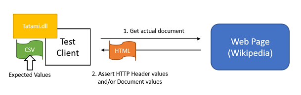

# Showcase: Wikipedia page test

### Scenario : Test a HTML structure of "United States" page using static expected values.
This scenario covers to test between html values and static values in CSV. 

* Test target : [http://en.wikipedia.org/wiki/United_States](http://en.wikipedia.org/wiki/United_States)
* Sample Tests : spec\sample_implementation 
* Test spreadsheet : [https://docs.google.com/spreadsheets/d/1Gvnq2NlBXyrnsjBH0Xr-R8U0f9RLeCR9RH5eAdTL_XE/edit?usp=sharing](https://docs.google.com/spreadsheets/d/1Gvnq2NlBXyrnsjBH0Xr-R8U0f9RLeCR9RH5eAdTL_XE/edit?usp=sharing)
* CSV download link: [https://docs.google.com/spreadsheets/d/1Gvnq2NlBXyrnsjBH0Xr-R8U0f9RLeCR9RH5eAdTL_XE/export?format=csv&id=1Gvnq2NlBXyrnsjBH0Xr-R8U0f9RLeCR9RH5eAdTL_XE&gid=0](https://docs.google.com/spreadsheets/d/1Gvnq2NlBXyrnsjBH0Xr-R8U0f9RLeCR9RH5eAdTL_XE/export?format=csv&id=1Gvnq2NlBXyrnsjBH0Xr-R8U0f9RLeCR9RH5eAdTL_XE&gid=0)

### Test details
1. Get a actual html document from Web App.
1. Assert HTTP response header and/or document values using expected values in CSV file.



### Setup steps
1. Create a test project.
1. Add this line to your application's Gemfile.

	```ruby
	gem 'tatami', :git => 'https://github.com/kenyamat/tatami.git' 
	```

	And then execute:

	    $ bundle

	Or install it yourself as:

	    $ gem install tatami

1. Create a BaseUriMapping.xml
	* See more details : [BaseUriMapping.xml settings](BaseUriMapping.md)	
1. Create a UserAgentMapping.xml 
	* See more details : [UserAgentMapping.xml settings](UserAgentMapping.md)	
1. Create a CSV file including test cases.
	* csv file : [https://docs.google.com/spreadsheets/d/1Gvnq2NlBXyrnsjBH0Xr-R8U0f9RLeCR9RH5eAdTL_XE/edit?usp=sharing](https://docs.google.com/spreadsheets/d/1Gvnq2NlBXyrnsjBH0Xr-R8U0f9RLeCR9RH5eAdTL_XE/edit?usp=sharing)
1. Create a test method.
	* spec\sample_implementation\sample_implementation_spec.rb

	```
	RSpec.describe 'Sample implementation', :sample_implementation => true do
	  let(:user_agent_mapping_xml) { File.read(File.join(File.dirname(__FILE__), 'settings/UserAgentMapping.xml'), :encoding => Encoding::UTF_8) }
	
	  context 'HTML page test (Wikipedia)' do
	    let(:base_uri_mapping_xml) { File.read(File.join(File.dirname(__FILE__), 'settings/BaseUriMapping_Wikipedia.xml'), :encoding => Encoding::UTF_8) }
	    it {
	      test_case_url = 'https://docs.google.com/spreadsheets/d/1Gvnq2NlBXyrnsjBH0Xr-R8U0f9RLeCR9RH5eAdTL_XE/export?format=csv&id=1Gvnq2NlBXyrnsjBH0Xr-R8U0f9RLeCR9RH5eAdTL_XE&gid=0'
	      test_cases_csv = HTTPClient.new.get_content(test_case_url).force_encoding('UTF-8')
	      base_uri_mapping = Tatami::Parsers::Mappings::MappingParser.parse(base_uri_mapping_xml)
	      user_agent_mapping = Tatami::Parsers::Mappings::MappingParser.parse(user_agent_mapping_xml)
	      result = Tatami::TestExecutor.new(test_cases_csv, base_uri_mapping, user_agent_mapping).test
	      puts result.get_failed_message
	      expect(result.success?).to eq true
	    }
	  end
	end
	```

1. Run test.
